# Deploying Plex on Acorn

Elevate your entertainment with Plex! Effortlessly organize, stream, and enjoy your media library anywhere, anytime. Plex's sleek interface, cross-platform compatibility, and remote access redefine how you experience movies, TV shows, music, and photos. Now, if you are considering hosting your own Plex Media Library, thats a nifty idea! With features like server-side transcoding and offline access, you can host your own Media Library using Plex for the ultimate media streaming and management experience. But if you are not familiar with the server and network setup that it requires, you might face some challenges. 

With modern cloud-native services and technologies, complexities of setting up your infrastructure shouldn't be the reason to stop you. Enter [Acorn](http://www.acorn.io) - Unleash the power of seamless deployment, scalability, and top-notch security. Acorn simplifies the elaborate process to build, run and scale your applications by providing a comprehensive way to describe your application and dependencies in a single file called an [Acornfile](https://docs.acorn.io/reference/acornfile). There's more, you can experience the [Acorn Cloud Platform](https://acorn.io/auth) which includes free compute environments in the cloud for anyone with a GitHub account to run, test, and develop Acorns. 

Today, we will explore how we can deploy Plex to host your own Media Library using Acorns. Before, we dive deep into creating your own Acorns, you can give Plex a shot by clicking the below link to launch the app immediately in a free sandbox environment. All you need is a GitHub ID to create an account.

[](https://acorn.io/run/ghcr.io/infracloudio/plex-acorn:v1.32.8-0?ref=aashimodi14&name=plex-app)

Let's get started with the tutorial to deploy Plex.

> _Note: Everything shown in this tutorial can be found in [this repository](https://github.com/infracloudio/plex-acorn)_.
## Pre-requisites

- Acorn CLI: The CLI allows you to interact with the Acorn Runtime as well as Acorn to deploy and manage your applications. Refer to the [Installation documentation](https://docs.acorn.io/installation/installing) to install Acorn CLI for your environment.
- A GitHub account is required to sign up and use the Acorn Platform.

## Acorn Login

Log in to the [Acorn Platform](https://acorn.io) using the GitHub Sign-In option with your GitHub user.

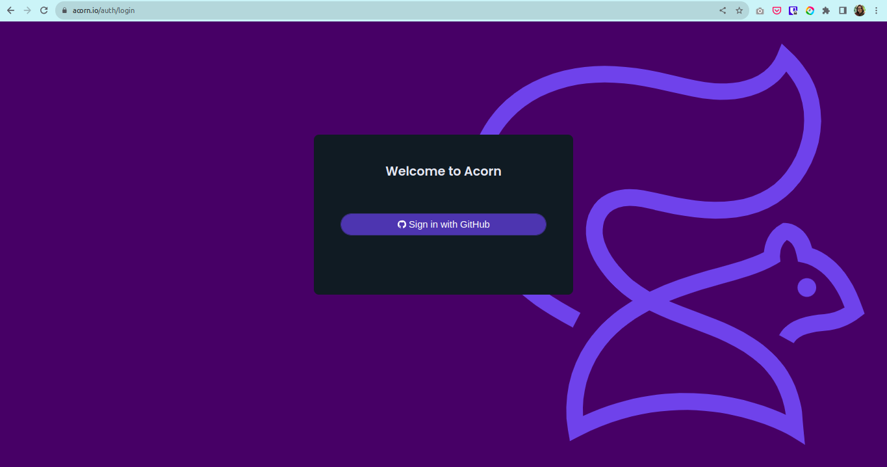

After the installation of Acorn CLI for your OS, you can login to the Acorn platform.

```sh
$ acorn login
```

## Deploying the Plex Media Server App

There are two ways to deploy Plex server on Acorn Platform.

1. Using Acorn platform dashboard.
2. Using CLI

The Acorn Dashboard way is the easiest one where, in just a few clicks you can deploy the Plex on the platform and start using it. However, if you want to customize the application use the CLI option.

## Deploying Using Acorn Dashboard

In this option you use the published Acorn application image to deploy the Plex in just a few clicks. It allows you to deploy your applications faster without any additional configurations. Let us see below how you can deploy Plex to the Acorn platform dashboard.

1. Login to the [Acorn Platform](https://acorn.io/auth/login) using the Github Sign-In option with your Github user.
2. Select the "Already have an Acorn? Deploy" option.
3. Choose the source for deploying your Acorns
   3.1. Select “From Acorn Image” to deploy the sample Application.

   

   3.2. Provide a name "plex-app”, use the default Region and provide the URL for the Acorn image and select Advanced Options on bottom left corner and click Next.

   ```sh
   ghcr.io/infracloudio/plex-acorn:v#.#.#-#
   ```
   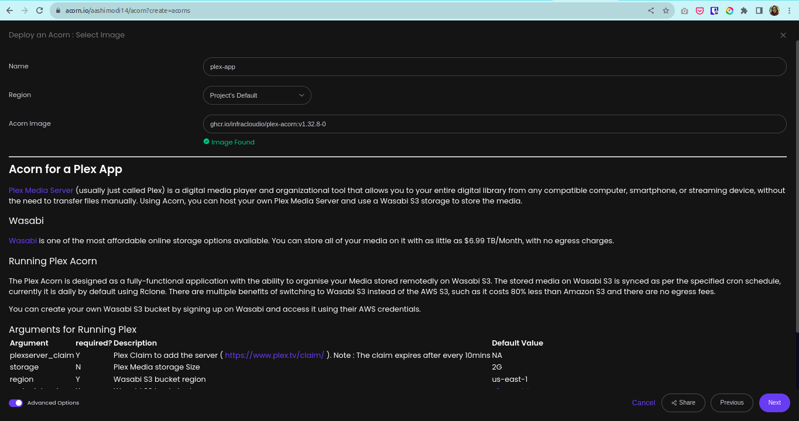

   Provide Advanced Configurations to deploy Plex: 

   **Plexserver Claim**: Add the Plex Claim Token (To create the Plex Claim Token, login to https://www.plex.tv and copy the generated token from the link - https://www.plex.tv/claim/.)
   **Bucket Name**: Wasabi S3 Bucket Name
   **Access Key**: Wasabi S3 Access Key
   **Secret Key**: Wasabi S3 Secret Key
   **Rclone Schedule**: Rclone Cron Job Schedule to periodically sync the Wasabi S3 bucket with Plex Media Volume. Current default Value is `0 */6 * * *` i.e. Every 6 hours

  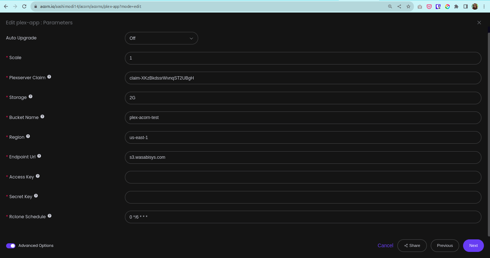

> _Note: The App will be deployed in the Acorn Sandbox Environment. As the App is provisioned on AcornPlatform in the sandbox environment it will only be available for 2 hrs and after that it will be shutdown. Upgrade to a pro account to keep it running longer_.
4. Once the Acorn is running, you can access it by clicking the redirect link icon.

   4.1. Running Application on Acorn

   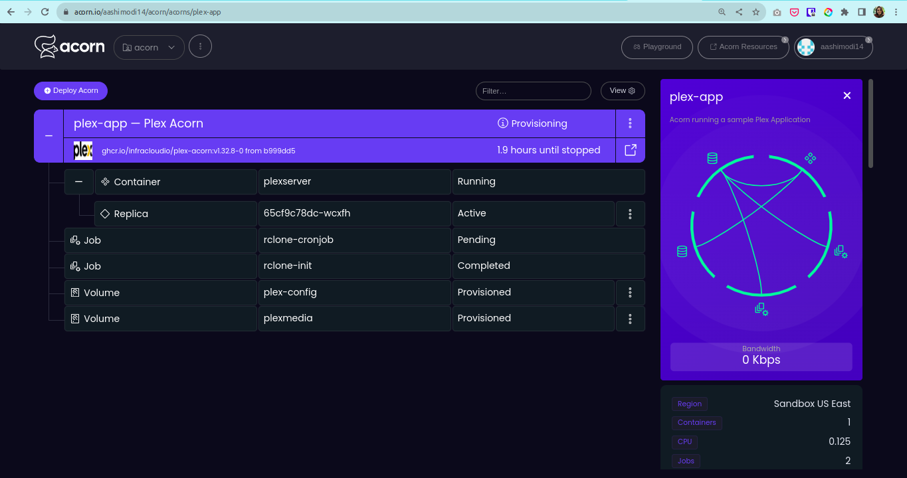

   4.2. Running Plex

   

## Deploying Using Acorn CLI

As mentioned previously, running the Acorn application using CLI lets you understand the Acornfile. With the CLI option, you can customize the Plex to your requirement or use your Acorn knowledge to run your own application.

To run the application using CLI you first need to clone the source code repository on your machine.

```sh
$ git clone https://github.com/infracloudio/plex-acorn.git
```

Once cloned here’s how the directory structure will look.

```sh

.
├── Acornfile
├── LICENSE
├── plex-icon.png
├── rclone-config-script.sh
├── README.md

```

### Understanding the Acornfile

To run the application we need an Acornfile which describes the whole application without all of the boilerplate of Kubernetes YAML files. The Acorn CLI is used to build, deploy, and operate Acorn on the Acorn cloud platform.

Before we dive into the intricacies of writing your own Acornfiles, available [Acorn elements](https://docs.acorn.io/reference/acornfile), usage of [Acorn Services](https://docs.acorn.io/authoring/services) and [Acorn Jobs](https://docs.acorn.io/authoring/jobs) might be worth exploring.  

Below is the Acornfile for deploying the Plex Server that we created earlier:

```sh

args: {
  scale: 1
  // required: Plex Claim Token
  plexserver_claim: ""
	// Optional: Plex media volume size
	storage:          "2G"
	// Required: Wasabi bucket name
	bucket_name:      ""
	// Required: Wasabi bucket region. Default: us-east-1
	region:           "us-east-1"
	// Required: Wasabi bucket url. Default: s3.wasabisys.com
	endpoint_url:     "s3.wasabisys.com"
	// Required: Wasabi access key
	access_key:       ""
	// Required: Wasabi secret key
	secret_key:       ""
	// Optional: Bucket sync job cron schedule. Default: every 6 hours.
  rclone_schedule:  "0 */6 * * *"
}

containers: {
  plexserver: {
    scale: args.scale
    env: {
      "PLEX_CLAIM": args.plexserver_claim
      "PGID": "1000"
      "PUID": "1000"
      "VERSION": "latest"
      "TZ": "Asia/Kolkata"

    }
    image: "ghcr.io/linuxserver/plex:1.32.8"
    ports: {
      publish: [
        "32400:32400/http",
        "32469/tcp",
        "3005/tcp",
        "8324/tcp",
        "1900/udp",
        "5354:5353/udp",
        "32410/udp",
        "32412/udp",
        "32413/udp",
        "32414/udp"
      ]
    }
    dirs: {
      "/config": "volume://plex-config"
      "/plexmedia": "volume://plexmedia"
    }
  }
}

jobs: {
  "rclone-init": {
      image: "rclone/rclone:latest"
      env: {
        RCLONE_CONFIG_MYS3_TYPE: "s3"
        AWS_ACCESS_KEY_ID:     args.access_key
        AWS_SECRET_ACCESS_KEY: args.secret_key
        AWS_S3_BUCKET:         args.bucket_name
				REGION:                args.region
				ENDPOINT_URL: 				 args.endpoint_url
      }
      dirs: {
        "./rclone-config-script.sh": "./rclone-config-script.sh"
        "/plexmedia": "volume://plexmedia"
      }
      entrypoint: ["/bin/sh", "-c", "./rclone-config-script.sh"]
  }
  "rclone-cronjob": {
      image: "rclone/rclone:latest"
      env: {
        RCLONE_CONFIG_MYS3_TYPE: "s3"
        AWS_ACCESS_KEY_ID:     args.access_key
        AWS_SECRET_ACCESS_KEY: args.secret_key
        AWS_S3_BUCKET:         args.bucket_name
				REGION:                args.region
				ENDPOINT_URL: 				 args.endpoint_url
      }
      dirs: {
        "./rclone-config-script.sh": "./rclone-config-script.sh"
        "/plexmedia": "volume://plexmedia"
      }
      entrypoint: ["/bin/sh", "-c", "./rclone-config-script.sh"]
      schedule: args.rclone_schedule
  }
}

volumes: {
  "plex-config": {
    size: 100M
  }
  "plexmedia": {
    size: args.storage
  }
}

```

There are various components for running the Plex

- plex application
- rclone jobs : init-job and periodic-job

The above Acornfile has the following elements:

- **Args**: Required and Optional User Arguments for running Plex 
  - **plexserver_claim**: required: Plex Claim Token. To create the Plex Claim Token, login to https://www.plex.tv and copy the generated token from the link - https://www.plex.tv/claim/.
  - **storage**: Optional: Plex media volume size. Default Value : 2G
  - **bucket_name**: Required: Wasabi bucket name
  - **region**: Required: Wasabi bucket region. Default: us-east-1
  - **endpoint_url**: Required: Wasabi bucket url. Default: s3.wasabisys.com
  - **access_key**: Required: Wasabi access key
  - **secret_key**: Required: Wasabi secret key
  - **rclone_schedule**: Optional: Rclone Cron Job schedule to periodically sync the Wasabi S3 bucket with Plex Media Volume. Default: every 6 hours.
- **Containers**: We define the plexserver container with following configurations:
  - **plexserver**:
    - **scale**: Plexserver Replicas
    - **image**: It defines Petclinic image
    - **env**: Environment variables for running the plex server.
    - **ports**: ports required by the application.
    - **dirs**: Config and Plex Media Volume mounts for the app.
- **Jobs**: 
  - **rclone-init**: Rclone Job for initial Data Sync from the Wasabi S3 bucket and Plex Media volume.
    - **image**: Rclone image
    - **env**: Environment variables for running the Plex.
    - **dirs**: Rclone script to create rclone configs for wasabi s3 sync and Plex Media Volume mount.
    - **entrypoint**: Run the config script on container start.
  - **rclone-cronjob**: Rclone Cron Job for periodic Data Sync from the Wasabi S3 bucket and Plex Media volume with default cron schedule of every 6hrs. 

### Running the Application

Once you've logged using Acorn CLI you can directly deploy applications on the Acorn platform Sandbox plan. Run the following command from the root of the directory.

```sh
$ acorn run -n plex-app . --plexserver_claim <> --bucket_name <> --access_key <> --secret_key <>
```

Below is what the output looks like.

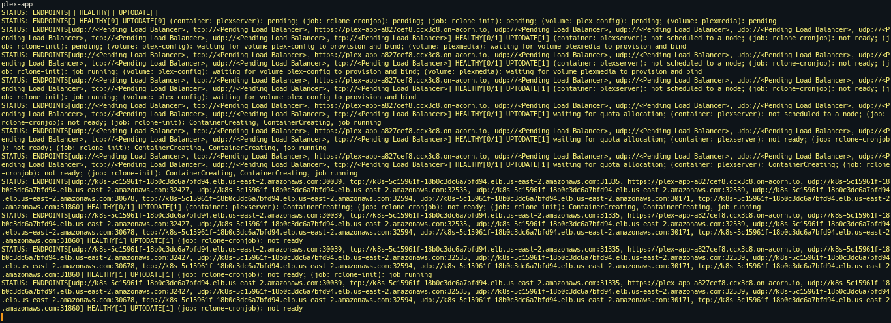

## Using Plex

The Acornfile is configured with defaults and is available to run the Plex as is once your own Wasabi S3 credentials are configured.


### Plex Media Library Setup

First time setup of Plex includes setting up your own Media Library like Movies, TV Shows, Music, Photos or Other Videos for Plex.

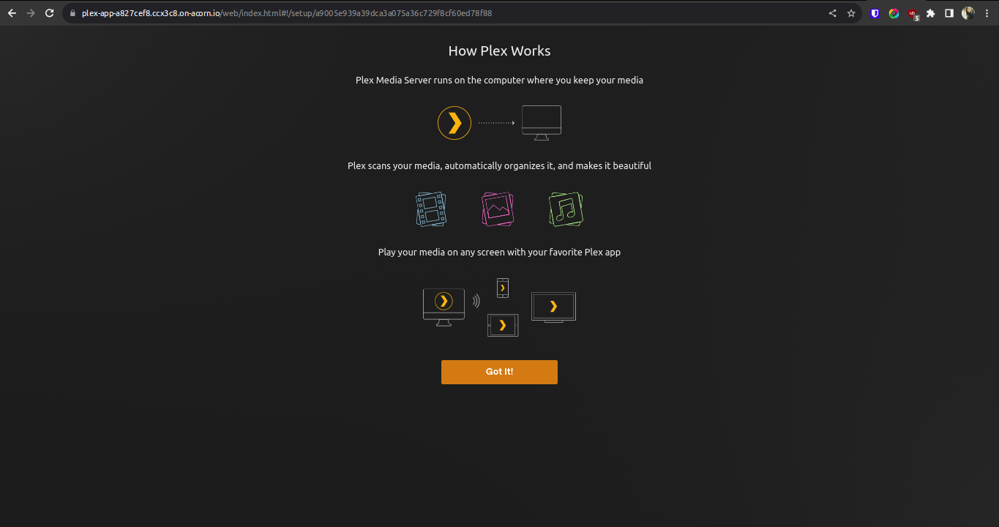
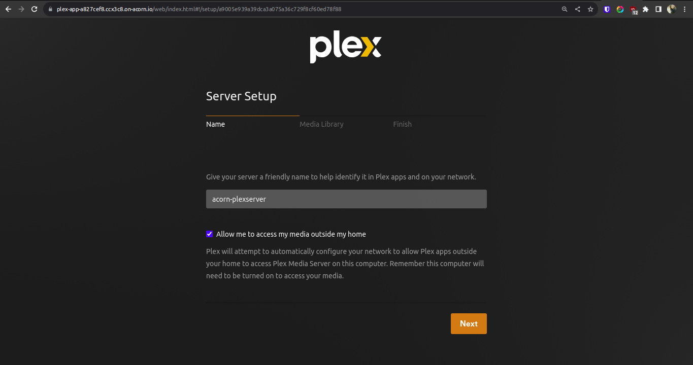
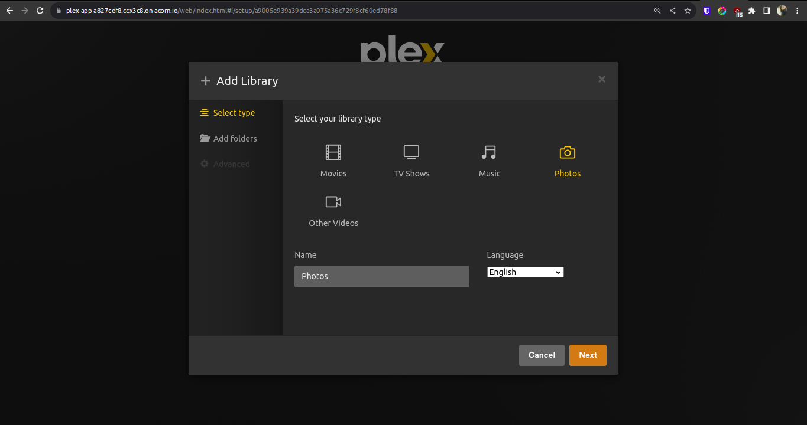
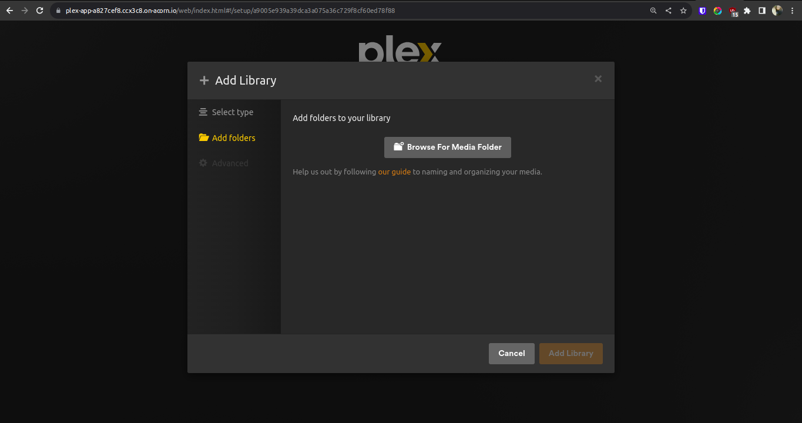
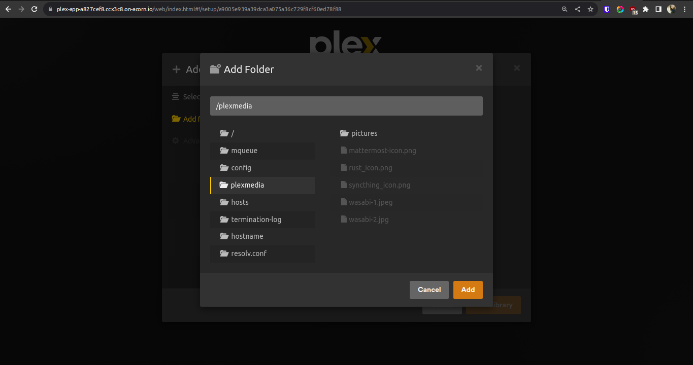
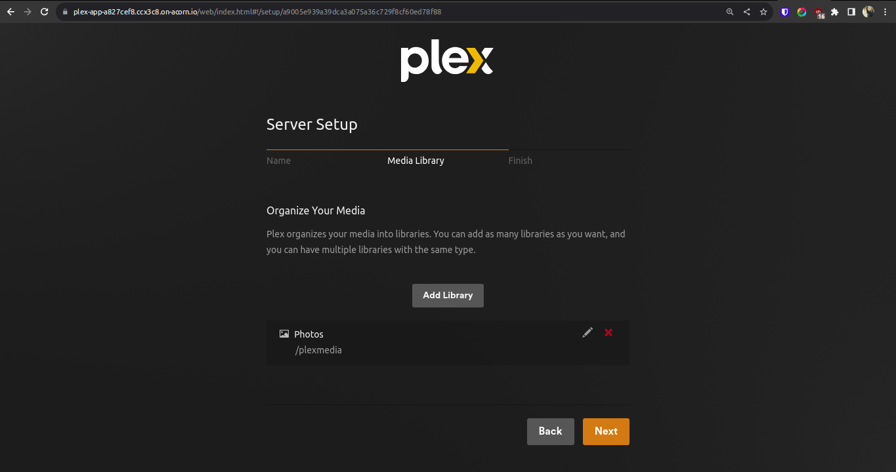

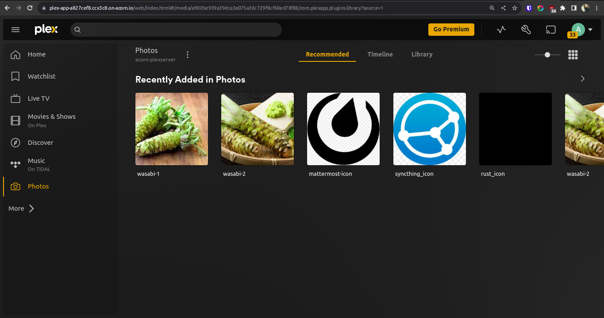


## What's Next?

1. Plex provisioned on Acorn Platform is available for two hours, you should upgrade to Pro account to keep it running for longer duration.
2. After deploying you can edit the Acorn Application or remove it if no longer needed. Click the `Edit` option to edit your Acorn's Image. Toggle the `Advanced Options` switch for additional edit options.
3. Remove the Acorn by selecting the `Remove` option from your Acorn dashboard.

## Conclusion

In this tutorial we explored how to host your own Plex Media Server and use Acorn to seemlessly not only deploy the application but also extend it to perform automated scheduled job for your app. Also, different ways to deploy the app using CLI and Dashboard approach.